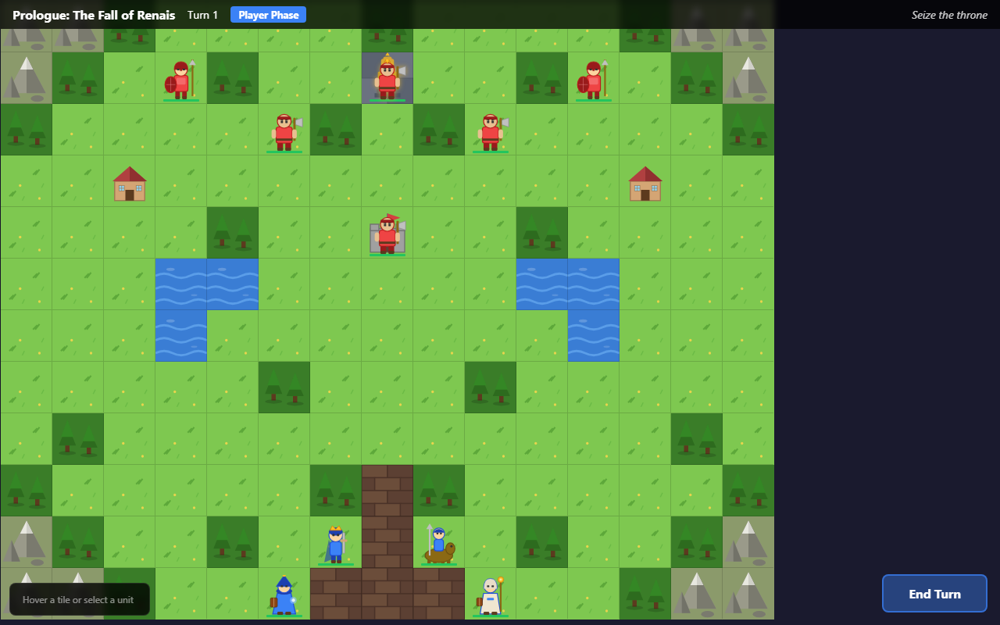

# 2D SRPG — Fire Emblem-Style Tactical RPG



A Fire Emblem-inspired tactical strategy RPG built with **React 18 + TypeScript + Vite**. DOM-only rendering (no canvas) for full E2E testability.

## Features

- **Tactical grid combat** — movement ranges, attack ranges, danger zones
- **Weapon triangle** — swords > axes > lances > swords, magic triangle
- **GBA-style battle animations** — dash-across choreography, critical hit pauses, dodge leaps
- **Enemy AI** — aggressive, stationary, guard, and boss behaviors
- **Full campaign** — multiple chapters, reinforcements, seize objectives
- **RPG progression** — EXP, level-ups with stat growths, permadeath
- **Staff healing & consumable items**
- **Terrain effects** — forests, forts, throne with defense/avoid bonuses
- **Seeded RNG** — deterministic gameplay via `?seed=` URL param

## Quick Start

```bash
npm install
npm run dev          # Dev server at localhost:5173
npm run build        # Production build
npx vitest run       # Unit tests
npx playwright test  # E2E tests (needs dev server)
```

## Tech Stack

- **React 18** — functional components + hooks
- **TypeScript** — strict mode
- **Vite** — dev server + bundler
- **Zustand** — state management (3 stores: game, UI, campaign)
- **Vitest** — unit tests for core game logic
- **Playwright** — E2E tests with screenshot capture
- **SVG sprites** — all art generated inline, no external assets

## Architecture

```
src/
  core/        Pure game logic (combat, pathfinding, AI, RNG) — zero React imports
  data/        Static data (weapons, units, classes, chapters)
  stores/      Zustand stores + action modules
  components/  React UI layer (grid, units, combat, menus)
  hooks/       Custom hooks (keyboard, camera, game loop)
  styles/      CSS organized by component
```

See [CLAUDE.md](CLAUDE.md) for the full architecture guide.
