# Fire Emblem: Renais — Screenshot Report

## Implementation: Start Menu, Save System, Story Dialogue & Campaign Structure

**Date:** 2026-02-28
**Test Results:** 62 unit tests + 23 E2E tests = **85 total, all passing**
**TypeScript:** Clean (`npx tsc --noEmit` — zero errors)

---

## New Features Implemented

### 1. Title Screen
- Game title "Fire Emblem: Renais" in gold with glow
- "TACTICAL RPG" subtitle
- New Game / Continue / Chapter Select buttons
- Continue is disabled when no save data exists
- Dark gradient background with frosted-glass button styling

### 2. Save System
- 3 save slots using localStorage
- Auto-save on chapter completion (after epilogue)
- Load game from Continue menu
- Version-checked save format with corruption safety
- 9 unit tests covering round-trip, corruption, deletion, slot queries

### 3. Story Dialogue System
- Full-screen dialogue overlay with bottom panel (classic JRPG style)
- Speaker names color-coded by faction (blue = player, gold = narrator, red = enemy)
- Progress indicator ("3 / 7 — Click or press Enter")
- Advance via click, Enter, or Space
- Prologue plays before chapter battle; epilogue plays after victory

### 4. Campaign Structure
- 25-chapter campaign defined in `campaignConfig.ts`
- Chapter 1 fully implemented with prologue (7 lines) and epilogue (4 lines)
- Chapters 2–25 defined as metadata (not yet playable)
- Chapter Select menu shows completed/available chapters
- Unit stat persistence between chapters via `UnitProgress`

### 5. Victory/Defeat Flow
- Victory screen shows "Continue" button → triggers epilogue dialogue → auto-save → title
- Defeat screen shows "Return to Title" button
- Unit progress (level, exp, stats) extracted and saved on victory

### 6. Backward Compatibility
- `?seed=` URL parameter bypasses title/dialogue, goes straight to battle
- All 17 existing E2E tests pass without modification

---

## Screenshots

### Title Screen & Menus

| # | Screenshot | Description |
|---|-----------|-------------|
| 01 |  | Main title screen with New Game, Continue (disabled), Chapter Select |
| 02 | 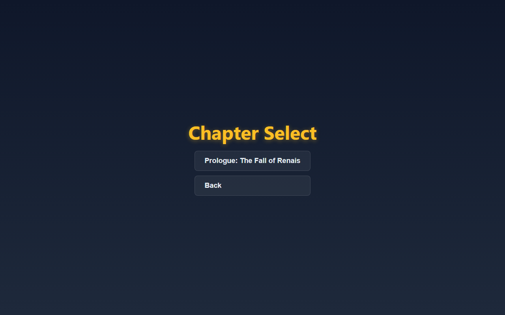 | Chapter Select sub-menu showing "Prologue: The Fall of Renais" |
| 03 | 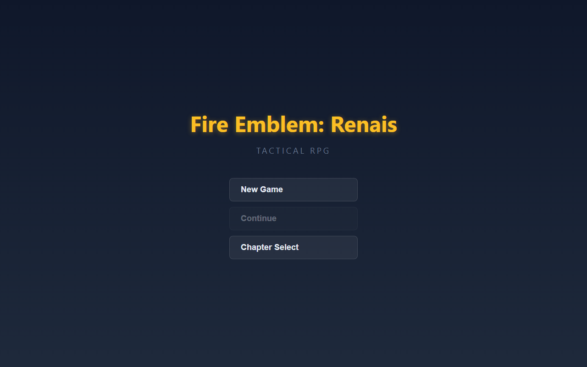 | Continue button grayed out (no save data) |

### Prologue Dialogue

| # | Screenshot | Description |
|---|-----------|-------------|
| 04 | 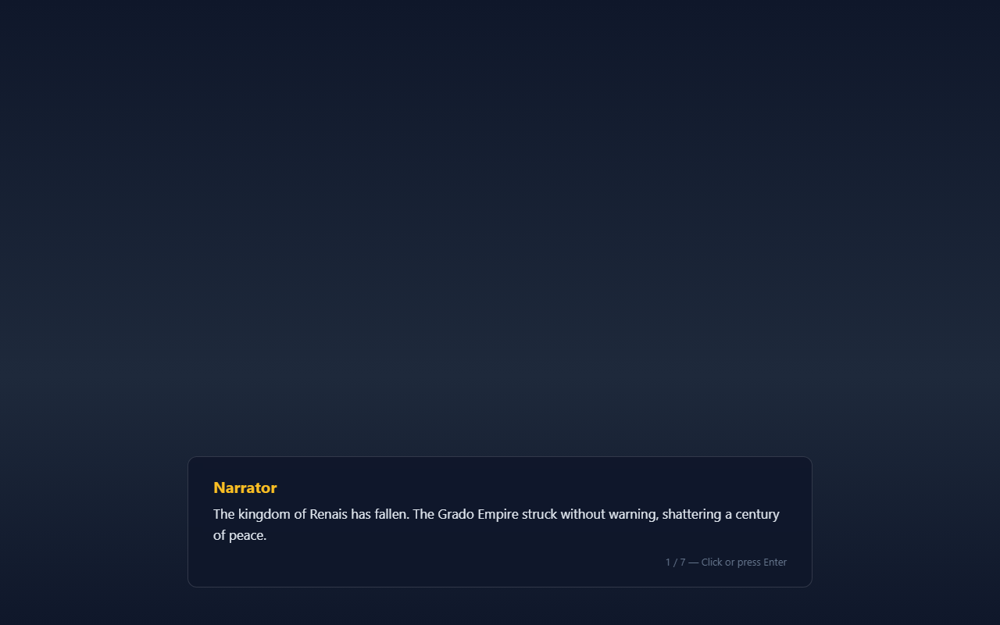 | Narrator (gold) — "The kingdom of Renais has fallen..." (1/7) |
| 05 |  | Eirik (blue) — "Father... The castle is lost." (2/7) |
| 06 | 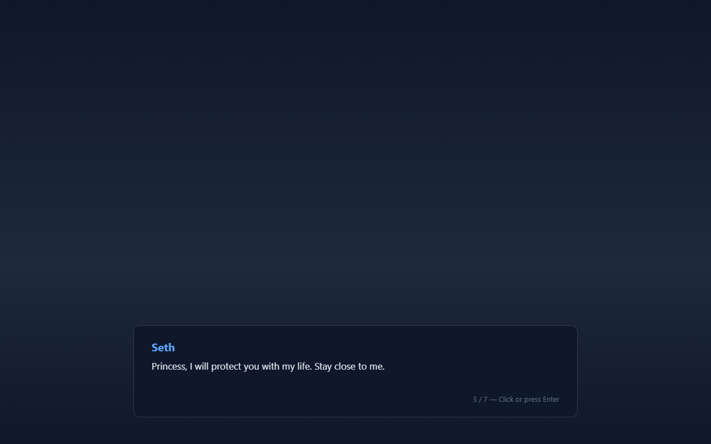 | Seth (blue) — "Princess, I will protect you with my life." (3/7) |
| 07 | 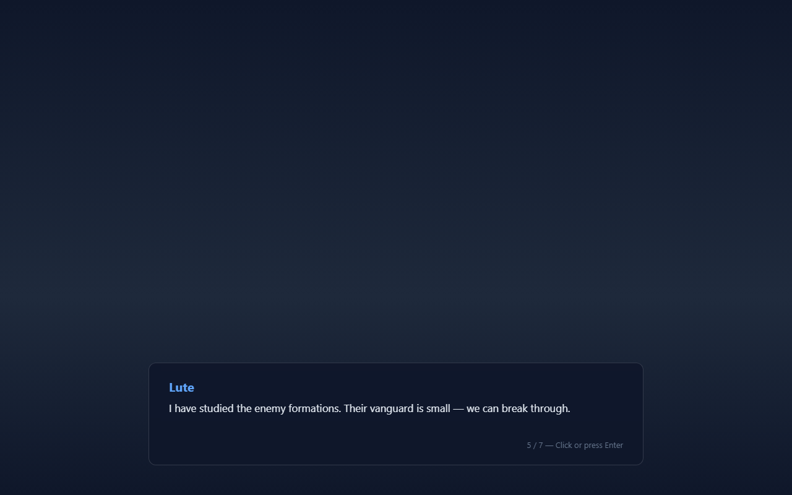 | Lute (blue) — "I have studied the enemy formations." (5/7) |
| 08 | 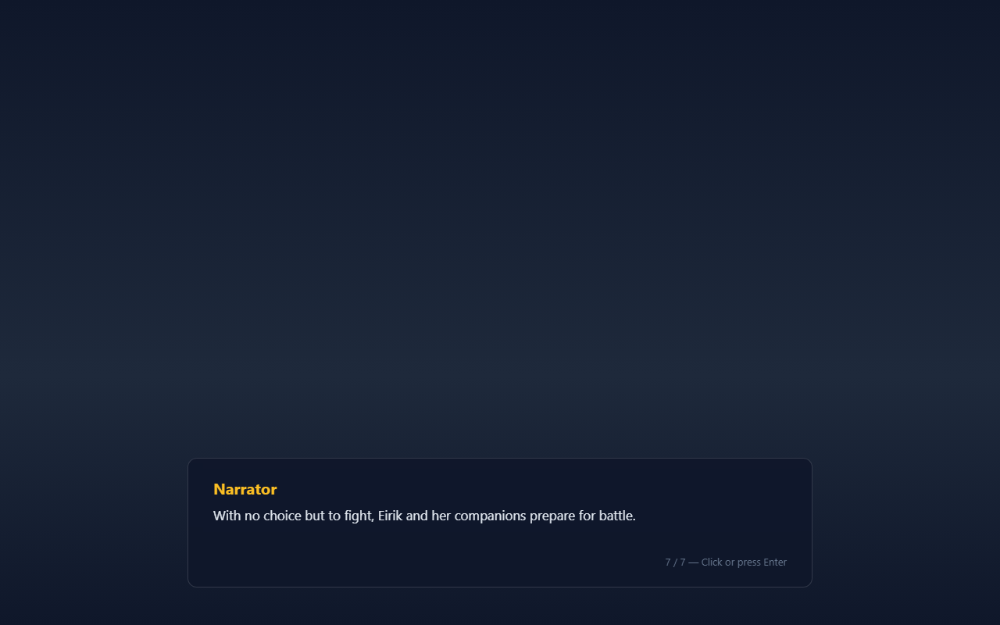 | Narrator (gold) — "Eirik and her companions prepare for battle." (7/7) |

### Battle (Post-Dialogue Transition)

| # | Screenshot | Description |
|---|-----------|-------------|
| 09 | 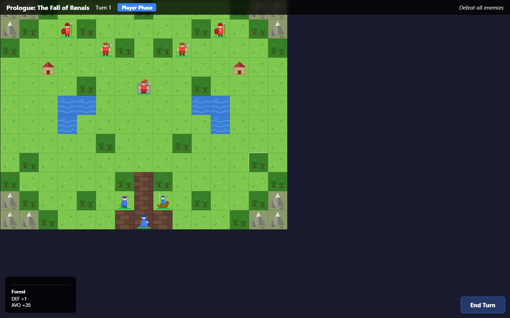 | Tactical grid loads after prologue — Turn 1, Player Phase |
| 10 | 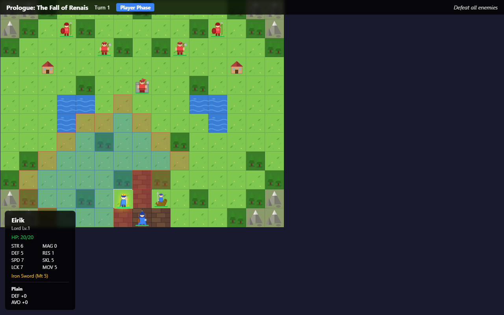 | Eirik selected — movement range (blue/green) + attack range (red) + stats panel |
| 11 | 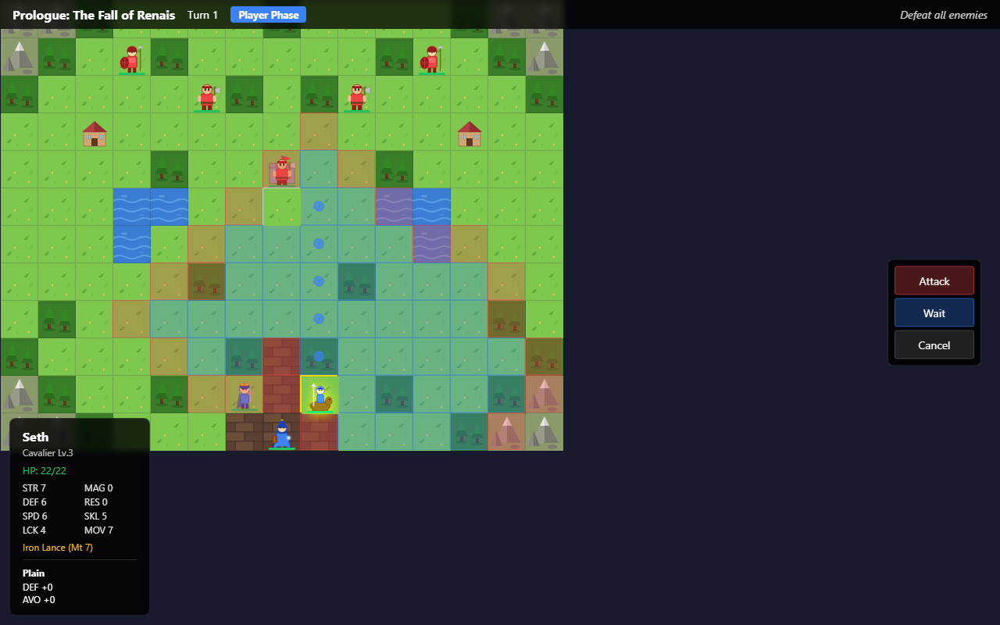 | Seth moved to (7,5) — Attack / Wait / Cancel action menu |
| 12 | 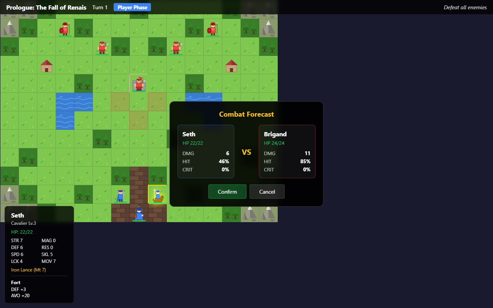 | Combat Forecast: Seth (Lance) vs Brigand (Axe) — DMG/HIT/CRIT stats |
| 13 | 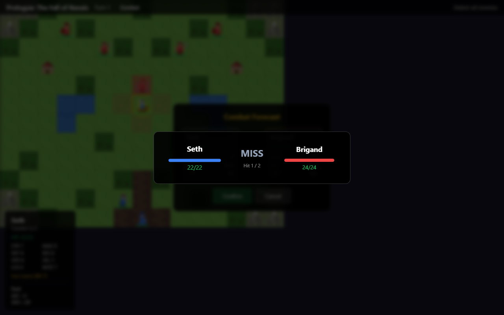 | Combat animation — Seth attacks, MISS displayed, HP bars shown |

### Backward Compatibility

| # | Screenshot | Description |
|---|-----------|-------------|
| 14 | 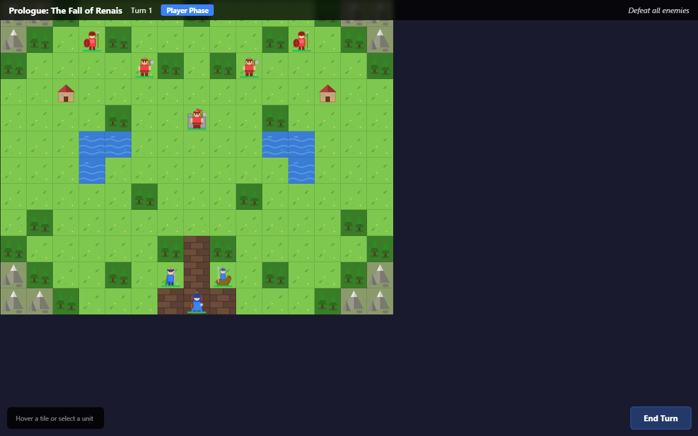 | `?seed=12345` skips title/dialogue — straight to battle (E2E test compat) |

---

## Files Changed

### New Files (8)
| File | Purpose |
|------|---------|
| `src/core/saveManager.ts` | localStorage save/load (3 slots, version check) |
| `src/stores/campaignStore.ts` | Screen routing, progress, dialogue, save/load |
| `src/data/chapters/index.ts` | Chapter registry |
| `src/data/campaignConfig.ts` | 25-chapter campaign metadata |
| `src/components/TitleScreen.tsx` | Title screen with sub-menus |
| `src/components/DialogueBox.tsx` | Story dialogue overlay |
| `tests/unit/saveManager.test.ts` | 9 unit tests for save system |
| `tests/e2e/startMenu.spec.ts` | 6 E2E tests for title + dialogue |

### Modified Files (6)
| File | Changes |
|------|---------|
| `src/core/types.ts` | Added DialogueLine, DialogueScene, UnitProgress, SaveData, AppScreen; extended ChapterData |
| `src/data/chapters/chapter1.ts` | Added chapterNumber, 7-line prologue, 4-line epilogue |
| `src/stores/gameStore.ts` | initChapter accepts optional unitProgress for stat persistence |
| `src/App.tsx` | Screen router (title/dialogue/battle) with ?seed backward compat |
| `src/components/Game.tsx` | Reads chapter from campaignStore; victory/defeat buttons |
| `src/styles/ui.css` | +120 lines for title screen, dialogue box, game-over buttons |

---

## Test Summary

| Suite | Count | Status |
|-------|-------|--------|
| Unit: smoke | 1 | PASS |
| Unit: terrain | 7 | PASS |
| Unit: pathfinding | 11 | PASS |
| Unit: combat | 23 | PASS |
| Unit: experience | 11 | PASS |
| Unit: saveManager | 9 | PASS |
| E2E: movement | 7 | PASS |
| E2E: combat | 5 | PASS |
| E2E: chapter | 5 | PASS |
| E2E: startMenu | 6 | PASS |
| **Total** | **85** | **ALL PASS** |
